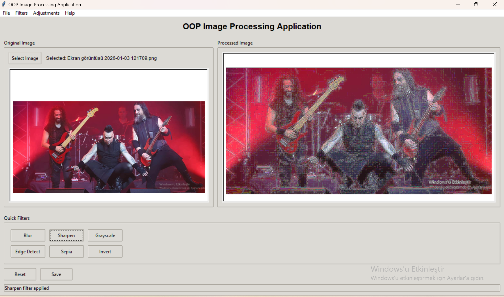

# 🎨 OOP Image Processing Application

A modular **Object-Oriented Image Processing Desktop Application** built with Python and Tkinter.

This project demonstrates:
- Clean OOP Architecture
- Factory Design Pattern
- Modular Filter System
- GUI Component Separation
- Extensible Design

---

## 🚀 Features

### 🖼 Image Operations
- Load image (JPG, PNG, BMP, TIFF, GIF)
- Apply filters:
  - Blur
  - Sharpen
  - Grayscale
  - Edge Detect
  - Sepia
  - Invert
- Reset to original
- Save processed image

---

## 🏗 Architecture

### Core Components

- **ana_uygulama.py** → Main GUI controller  
- **resim_yonetici.py** → Image state & processing manager  
- **fabrikalar.py** → Factory Pattern implementation  
- **filtreler.py** → Filter classes  
- **gui_components.py** → UI components  
- **logger.py** → Logging system  

---

## 🔄 Processing Flow

1. User selects image
2. ImageManager loads original image
3. User selects filter
4. Factory creates filter object
5. ImageManager applies filter
6. Processed image updates in UI

---

## 🖼 Screenshots

> Place your screenshots inside a folder named **screenshots/** in the project root.

### Blur Filter


### Sharpen Filter


### Grayscale Filter


### Edge Detection


### Invert Filter


---

## ⚙ Installation

```bash
python -m venv .venv
# Windows
.venv\Scripts\activate
pip install -r gereksinimler.txt
```

---

## ▶ Run

```bash
python ana.py
```
or
```bash
python ana_uygulama.py
```

---

## 📂 Project Structure

```
otobus_terminali/
│
├── ana.py
├── ana_uygulama.py
├── config.py
├── temel_siniflar.py
├── resim_yonetici.py
├── fabrikalar.py
├── filtreler.py
├── gelistirmeler.py
├── gui_components.py
├── logger.py
├── utils.py
├── gereksinimler.txt
├── testler/
├── screenshots/
└── README.md
```

---

## ➕ How to Add a New Filter

1. Create new class in filtreler.py
2. Implement process() method
3. Register filter inside fabrikalar.py
4. Add button/menu connection

---

## 🧠 Technologies Used

- Python
- Tkinter
- Pillow (PIL)
- OpenCV
- OOP Principles
- Factory Pattern

---

## 📜 License

MIT License

